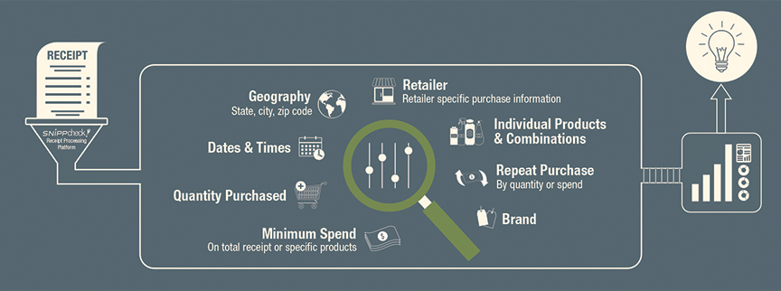
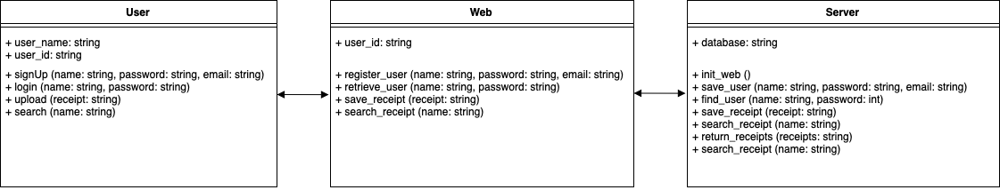
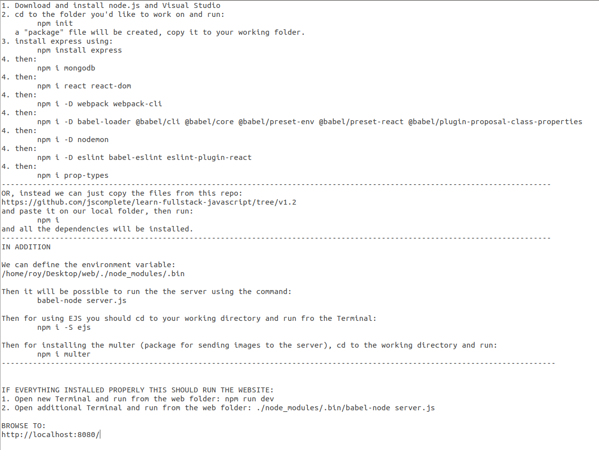

# Receipt Analysis

A web application which allows you: 
1. Upload purchase receipts and store them on the cloud 
2. Analyze their content using OCR open source library, in order to keep track of your expenses.
4. Get access to your purchase history using restApi

Target audience - private users and developers.

## Getting Started
These instructions will get you a copy of the project up and running on your local machine for development and testing purposes. See deployment for notes on how to deploy the project on a live system.

### Prerequisites

### Installing

## Running the tests

### Break down into end to end tests

### And coding style tests

## Deployment

## Built With

## Contributing

## Authors

* **Ran Hadar** 
* **Roy Akerman** 
* **Ruti Popilov** 
* **Or Nokrean** 

## License

## Acknowledgments

